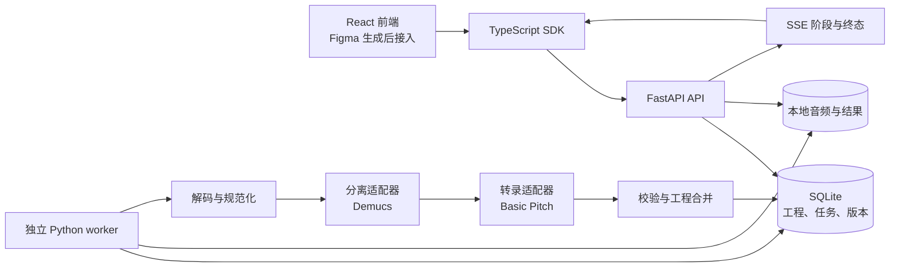

# 多轨音乐工作台架构

## 1. 目标、证据与当前范围

目标是用自己的应用代码和可复用模型建立「上传 → 音源分离 → 音符转录 → 编辑 → MIDI 导出」工作流。对原网站的公开前端调查只能确认这一流程和结果类型，不能证明它使用某个具体模型。本项目的 Demucs + Basic Pitch 是我们选择的可复现基线。

本轮提供本机后端、独立 worker、TypeScript SDK、接口合同与前端交接文档。Figma 前端将在用户提供代码或设计链接后接入。下文同时包含实施设计与后续前端要求；某项设计出现在文档中不代表已经实现或通过模型质量验证，具体运行结果以本轮验证记录为准。

首版有以下边界：

- 单用户、本机使用；SQLite 存工程与任务，本地目录存音频和结果。
- 默认分离为人声、鼓、贝斯、其他四类，不声称得到任意乐器的独立录音。
- Basic Pitch 处理有音高音轨；鼓保留音频并标记 `unsupported`。
- BPM 是默认值或用户指定值，拍号为 4/4；首版不宣称完成自动节拍识别。
- 不把演示数据、模拟任务或接口集成测试当作真实模型效果验证。

## 2. 总体结构



直接转录模式 `transcribe_only` 跳过分离阶段，把输入作为待转录的单乐器音频。该模式不会自动证明输入只有一个乐器，也不应自动给它贴上未知的乐器类别。

### 技术职责

| 层 | 选择 | 职责 |
| --- | --- | --- |
| 前端 | React + TypeScript + Vite | 三页应用、草稿编辑、播放与交互 |
| UI | Tailwind CSS + shadcn/ui | 通用组件、主题、可访问性 |
| 服务端状态 | TanStack Query | 获取与刷新项目、任务、保存响应 |
| 本地交互状态 | Zustand | 选中音符、撤销栈、播放游标、未保存草稿 |
| 可视化 | WaveSurfer.js + Canvas | 波形与钢琴卷帘绘制 |
| 音频 | Tone.js / Web Audio | 浏览器音频时钟与 MIDI 合成调度 |
| API | Python 3.11 + FastAPI + Pydantic | 校验、文件服务、任务入口、保存、导出 |
| 任务 | 独立 Python worker | 领取任务、加载模型、运行推理、记录进度与终态 |
| 持久化 | SQLite + 本地文件 | 最小可运行单机方案 |
| 导出 | mido | 标准多轨 MIDI 序列化 |

Python 3.11 是本项目建议的基线。模型运行环境必须实际安装验证并固定依赖版本；不能因为 API 环境能启动就声称 PyTorch、音频解码器和模型也已经就绪。

## 3. 三种数据与时间不要混用

### 3.1 原始录音、分离音频与音符

- **原始录音**：用户上传的混音，保留音色、混响、歌词和演奏细节。
- **分离音频**：模型估计出的声源录音，仍然可能有串音、残响和伪影。
- **音符**：音高、起点、持续时间、力度等可编辑事件；MIDI 合成音色不会与原始录音完全相同。

音符编辑只改变音符事件和 MIDI 试听，不会自动重做音频分离，也不会改写录音。因此前端必须明确「原音频」「分轨音频」「MIDI 音符」三种试听来源。

### 3.2 为什么音符统一用秒

服务端与前端保存：

```text
Note = { id, pitch, startSeconds, durationSeconds, velocity }
```

模型最自然地产生音频时间。将其直接存为秒，可以保留未量化的真实演奏位置；即使初始 BPM 不准确，音符仍能与录音对齐。如果先把音符强制吸附成节拍格，模型误差与节拍误差会混在一起，后续很难恢复。

合同约束：

- `pitch` 为 0..127 的整数，`velocity` 为 1..127 的整数。
- `startSeconds >= 0`，`durationSeconds > 0`，两者必须为有限数值。
- 每个音符 ID 在所属轨道内唯一；编辑时保留 ID，不依赖数组下标识别音符。
- 前端与后端都校验，后端为最终边界。非法数值不能静默写入工程。
- 音符可以重叠，不应把复音自动当作错误。原始编辑数据保留重叠音符；同轨同音高的重叠在 MIDI 导出层单独规范化，不自动重写工程。其他去重或最短时长过滤应作为明确的后处理步骤，参数与模型版本一起记录。

### 3.3 BPM 与网格

在固定 BPM 下：

```text
secondsPerBeat = 60 / bpm
beatPosition = seconds * bpm / 60
```

首版改变 BPM 保持音符秒数不变，只重绘节拍网格并改变 MIDI tick 映射。它不拉伸原音频，也不把录音变快。量化、整体变速、变拍号和变速图属于后续显式功能，不能混在 BPM 输入框里悄悄执行。

“BPM 来源”暂未写入 Project 合同。上传表单知道其当前值是默认还是手动设置；再次打开工程时，如果没有额外可靠元数据，只显示「工程 BPM · 非自动识别」。未来可以增加有版本的来源字段，而不是让前端猜测。

### 3.4 MIDI 导出

首版使用 480 ticks/quarter，并在文件中写入 tempo 和 4/4 拍号：

```text
startTick = round(startSeconds * bpm * 480 / 60)
endTick = max(startTick + 1,
              round((startSeconds + durationSeconds) * bpm * 480 / 60))
```

以音符结束绝对时间计算 endTick，再排序为相对 delta ticks，避免独立累计时长造成漂移。同一 tick 上先结束旧音符，再开始新音符；每条轨道的所有 note-on 都必须有对应 note-off。GM 音色编号使用 0..127；鼓通道在 MIDI 的零基编号中是 9（常说的第 10 通道），不能把“鼓”编码成音色 128。

同一 MIDI 通道无法用音符 ID 区分同音高的多个交叠事件。首版在导出时按轨道和音高合并重叠区间，使 note-off 只出现在合并后的区间末端，避免提前截断声音。不同轨道、不同音高的音符不合并；该处理只作用于导出副本，不改变工程中的 Note、ID 或撤销历史。MIDI 试听也应采用同一规范化规则，以便试听与导出一致。

导出代表当前保存的音符按上述规则规范化后的结果。前端若有草稿，应先保存成功再请求导出，不能静默下载旧版本。相同 BPM 写入文件并用于秒数换算后，重新读取 MIDI 的音符秒数应与规范化后的区间相近，仅允许 tick 舍入误差；重叠合并情况下不要求导出音符数量等于原始编辑音符数量。

## 4. 浏览器同步试听

### 4.1 一个时钟控制所有声部

使用一个共享 AudioContext 的音频时钟。播放时记录：

```text
offsetSeconds = 当前工程播放位置
scheduledContextTime = 音频实际开始的 context time
projectTime = offsetSeconds + (audioContext.currentTime - scheduledContextTime)
```

暂停保存当前位置并取消已经调度的播放节点。跳转先停止旧节点，再从新偏移量共同调度全部可听声部。循环和变速如未实现，应隐藏相关控件。

`requestAnimationFrame` 只根据音频时钟绘制光标；它不是音频时钟。后台标签页可能暂停视觉刷新，但不能让音轨各自用 `setInterval` 推进进度。每个 WaveSurfer 独立播放会逐渐错位，因此波形组件应接收统一游标，音频由同一调度层控制。

统一音频适配层建议负责：载入/释放资源、开始/暂停/停止、跳转、模式切换、混音参数、可播放状态和错误。组件只发用户意图，不直接创建互相独立的播放器。

### 4.2 三种播放模式

| 模式 | 播放对象 | 混音控件与限制 |
| --- | --- | --- |
| 原音频 | `sourceAudioUrl` | 单个原始混音；轨道混音控件不改变它 |
| 分轨音频 | 各 Track.audioUrl | 支持静音、独奏、音量、声像；保留分离结果的误差 |
| MIDI 音符 | 当前草稿的 Note 事件 | 使用可用的合成器/音源；音色与录音不同；没有鼓音符就没有鼓 MIDI 发声 |

切换模式保持工程位置，资源加载失败不能假装已经继续播放。所有模式都以同一“工程第几秒”定义定位。录音较短时自然停止该录音，其余音符或音轨可继续；总播放长度取可用音频时长与音符最大结束时间的最大值。

### 4.3 混音规则

设 `hasSolo` 表示至少一条轨道开启独奏，则：

```text
audible(track) = !track.muted && (!hasSolo || track.solo)
gain = audible(track) ? track.volume : 0
```

首版 `volume` 是 0..1 的线性增益，`pan` 是 -1..1。UI 如显示 dB 必须做真实转换，0 增益显示为静音；不要把 0.5 直接标成 -6 dB 以外的任意值。快速连续调整音量/声像时使用平滑参数变化减少爆音。

### 4.4 编辑期间的播放

避免提前调度整首曲子的旧音符。可采用短窗口预调度，或在音符编辑后取消尚未开始的旧事件并根据草稿重建未来事件。拖动期间可视反馈与音频重建分开，每次完整手势记录一次撤销动作。

Canvas 坐标与秒数转换集中管理：`x = (seconds - viewStartSeconds) * pixelsPerSecond`。波形、标尺、音符与播放光标共用该转换，不要各自保存一份略有差异的缩放系数。

## 5. 任务、队列与模型隔离

### 5.1 API 不运行重型推理

API 接收上传、校验元数据、创建项目与任务后快速返回。解码、分离、转录都由独立 worker 执行。这样模型加载、显存不足或长音频不会堵住普通项目读取和保存请求。

建议普通 API 依赖与模型依赖分组；可以使用独立虚拟环境或安装配置。模型缓存和任务临时目录应显式设置在项目目录内。首次下载权重、没有模型、没有解码器、显存不足必须是可识别的启动或任务错误，不用演示音符替代。

### 5.2 首版状态机

```text
Project:
empty → queued → processing → ready
                         └──→ failed / cancelled

Job:
queued → running → succeeded / failed / cancelled
  └────────────────────────→ cancelled

阶段:
queued → decode → separate → transcribe → merge → done
                                 任意阶段 → failed / cancelled
```

`transcribe_only` 跳过 `separate`。Job 的 succeeded 代表该任务产出符合合同的工程，不意味着所有乐器都已识别；鼓 `unsupported` 或某轨警告可以与 Project.ready 同时存在。若关键步骤失败且没有可用工程，任务应为 failed，不能只为让 UI 出现绿色而强行成功。

Project 包含 `latestJobId: string | null`。刷新编辑器时先读取 Project，再根据 latestJobId 获取最近 Job 和恢复 SSE；不要依赖上传页内存保留 jobId。null 表示尚未创建任务。`timeSignature` 在本轮创建、保存、响应和前端合同中都固定为 `'4/4'`。

每条完整轨道完成后，在同一个数据库事务中写入 Project.tracks、资源映射、工程版本及 `track.ready` 事件。发布前文件必须已完整存在，因此收到事件即可读取对应音轨音频。只有已发布的完整轨道可见，模型正在写入的文件不对前端开放。

任务失败或取消时可以保留已发布的轨道，任务终态仍然是 failed/cancelled，不因此伪装成 succeeded。前端把这些内容标记为「部分结果」。重新识别创建新项目，保留原项目的输入和部分结果，避免重试覆盖用户可以继续使用的内容。

状态写入要有明确所有者：worker 负责任务运行阶段与结果，API 负责用户修改与取消请求。终态一旦确定，不应由晚到的进度更新重新改回 running。

### 5.3 SQLite 领取与恢复

本机起步可使用持久化任务表，由 worker 在短事务中原子领取最早的 queued 任务。不能“先查询、稍后再修改”而让两个 worker 同时拿走一项任务。推理本身不持有数据库写事务。

首版以一个 worker、一次一个重型模型任务为稳定基线。开启多 worker 前，需要验证原子领取、文件隔离、GPU 资源分配与任务恢复。健壮版本应记录 worker/lease/heartbeat 等内部元信息，用于识别进程崩溃后遗留的 running 任务；这些是内部调度信息，不必混入前端 Project 合同。

恢复策略应明确为标记失败并允许用户重新开始，不能让任务永远停在“处理中”。重新识别创建新项目与新的任务临时目录；每条结果完整并通过校验后再原子发布，避免把半写入文件显示给用户，也避免覆盖旧工程的部分结果。

### 5.4 取消

取消是“请求停止”，并不保证底层一次模型调用会立刻结束。worker 应在解码后、分离后、轨道之间和合并前检查取消标志。若模型通过子进程运行，可以在实现了可靠清理后终止该子进程。

用户看到“正在取消”直到服务器确认终态。取消后不能由晚到的模型结果继续覆盖工程为 ready；已有输入与已经原子发布的完整轨道保留。未发布的临时结果按清理策略处理，不能删除已发布资源。用户重新识别时建立新工程。

### 5.5 进度与 SSE

- stage 与 message 必须来自真实执行位置。
- progress 无可靠依据时返回 null；模型没有逐帧回调时不要制造线性百分比。
- SSE 用于通知变化，SQLite 中保存的任务状态是权威记录。
- 断线不等于任务失败。前端重新读取 Project，使用 latestJobId 获取 Job 后再恢复事件监听；已发布的部分轨道可从 Project 恢复。
- 如果实现事件 ID 与重放，应按 API 文档使用；没有重放能力时通过重新获取当前状态保证恢复，不假称事件永不丢失。
- 项目终态、错误、警告和版本信息都必须能通过普通读取接口得到，不能只存在于一条 SSE 消息里。

## 6. 模型流水线与适配器

### 6.1 解码与规范化

检查文件可解码、时长、声道和采样率；保留源文件与原时长。后续模型可以使用各自需要的采样率，但所有结果时间必须映射回工程秒数。不要通过补尾、去静音或重采样偷偷改变音符相对原录音的位置。

### 6.2 Demucs 分离

默认四轨对应 `vocal`、`drums`、`bass`、`other`。Demucs 输出名称 `vocals`、`drums`、`bass`、`other` 需要显式映射到项目枚举，不能把库返回字段直接假定成 API 字段。

六轨是后续可选实验：增加 guitar/piano；它不自动提供 strings。Demucs 官方 README 指出其六轨钢琴分离存在较多串音和伪影，所以不能仅因出现 piano.wav 就宣称钢琴谱可靠。

### 6.3 Basic Pitch 转录

对支持的有音高轨道转录，转换为统一的 Note 数据。它跨乐器泛化，但官方说明一次一个乐器效果最好；混合的 other 轨仍可能产生错音和漏音。人声颤音、滑音、和声、长混响和分离伪影也会影响事件切分。

模型原生可包含 pitch bends，但首版 Note 合同没有弯音字段，不能声称完整保留人声滑音或吉他推弦。未来若增加弯音，应扩展有版本的数据合同与导出/编辑/试听三方实现。

鼓不交给通用音高转录冒充鼓组识别，返回 `transcriptionStatus: unsupported`、空 notes 与清楚的 warning。没有检测到音符时允许 completed + 空 notes；模型运行异常时为 failed，这三种情况必须区分。

### 6.4 可替换接口

分离适配器负责「音频 → 声源音频及元信息」，转录适配器负责「音频 → 音符及元信息」，节拍适配器未来负责「音频 → 节拍/变速图」。各适配器通过共同合同连接，避免让 API、项目存储或 Canvas 依赖 Demucs 内部类。

建议记录模型名称、模型/权重版本、推理参数、设备、输入时长、耗时与警告。这些可以放在服务端诊断元信息中，不必全部暴露为普通产品 UI，但必须能在质量对比时找到。

## 7. 工程保存与版本

Project.revision 用于乐观并发控制。客户端读取 revision N，保存时声明基于 N；服务端只有在当前版本仍是 N 时接受并递增，否则返回版本冲突。判断版本与写入必须在同一事务内进行。

Zustand 保留草稿与撤销历史，TanStack Query 保存服务器快照。后台刷新不能直接把未保存草稿替换掉。保存失败保留草稿，冲突时保留两个版本供用户选择，未经实现的自动合并不能装作成功。

任务写入与编辑也需要避免冲突：首版在 queued/running 期间禁用编辑，即使已经收到部分轨道，也只允许查看与试听。任务进入成功、失败或取消终态后，已有轨道可以继续编辑；失败和取消原因仍通过最近 Job 保留。未来若支持运行中编辑部分结果，必须定义任务结果如何合并到用户已改动的轨道与音符，而不是直接覆盖整个 Project。

## 8. 文件组织与单机运行

建议将输入、任务临时输出、已发布的分轨和模型缓存分开。文件由服务端生成 ID 并解析到受控目录，用户文件名只作显示；API 返回可访问 URL，不把本机绝对路径交给前端。

发布结果前确认全部文件存在、可读取且属于本任务。数据库保存相对标识与元数据，避免以后迁移路径时修改所有工程。长音频会同时占用原文件、解码 WAV、分轨 WAV、模型缓存与内存，失败清理和磁盘空间提示属于实际可用性要求。

当前版本面向本机。公网多用户部署需要独立的一期：认证、工程归属、文件访问控制、上传配额、并发限制和资源预算，以及 PostgreSQL / 对象存储 / 可恢复队列。不能把本地 API 启动成功当作已满足公网部署条件。

## 9. 验证与迭代

### 分层验收

| 层 | 验证方式 | 不能推出的结论 |
| --- | --- | --- |
| API 与任务 | 上传、领取、取消、错误终态、保存冲突、latestJobId 刷新恢复、部分结果保留、重试不覆盖 | 不能证明模型识别准确 |
| 文件与 MIDI | track.ready 发出时音频可读；MIDI 可重新读取；同音重叠按规则合并且原始工程不变；其余秒数往返误差受 tick 精度限制 | 不能证明音色接近原曲 |
| 真实模型冒烟测试 | 短单乐器音频产生有效音符，再跑短混音的真实分离与转录 | 不能代表所有风格或整曲效果 |
| 编辑器 | 拖动/删除后试听与导出一致；混音、模式切换、跳转对齐 | 不能修复底层分离质量 |
| 模型质量 | 固定样本与已知真值，分乐器统计漏音、错音、起止误差 | 不能仅用一个满意案例概括准确率 |

### 推荐迭代顺序

1. 用单乐器短音频验证直接转录，隔离分离误差。
2. 用具备独立分轨或 MIDI 真值的短混音验证四轨流水线。
3. 接入 Figma 前端，完成秒数编辑、同步试听、保存与 MIDI 导出。
4. 对照固定样本比较更好的分离权重、钢琴专用转录与鼓转录。
5. 添加节拍检测、变速图、量化与可撤销后处理。
6. 需要多人使用后再增加云任务基础设施。

关键风险是错误逐级传递：分离残留可能被转录成假音符，BPM 错误会让网格看起来错位，过强量化会掩盖原始时间。保留原音频、分离音频与未量化的转录结果，才能判断问题出在哪一层。

## 10. 模型与依赖许可

下表是已核验的上游仓库许可信息，用于选型与记录；交付某个二进制、权重或音源时，应针对实际采用的版本保留相应许可文件。

| 组件 | 上游信息 | 本项目应做什么 |
| --- | --- | --- |
| Demucs | [官方仓库](https://github.com/facebookresearch/demucs)标注 MIT；Meta 原仓库已归档，README 指向作者仓库 | 固定代码版本和权重来源，保留 MIT 文本；确认部署所用文件及其来源 |
| Basic Pitch | [Spotify 官方仓库](https://github.com/spotify/basic-pitch)标注 Apache-2.0 | 保留许可与适用 NOTICE；记录实际模型版本和转换格式 |
| 后续 RoFormer 等分离器 | [Music Source Separation Training](https://github.com/ZFTurbo/Music-Source-Separation-Training)提供 MIT 框架及多种架构 | 框架许可不能自动代表每份第三方预训练权重的许可，逐份查看模型卡与权重说明 |
| 浏览器 MIDI 音源 | 可能是合成振荡器，也可能是 SoundFont / 采样包 | 单独记录音色资源来源和分发条件，不把音源文件视为代码依赖自动获得授权 |

用户上传音频的使用权限与开源代码许可属于不同事项。私用原型不需要在页面塞入额外复杂流程，但后续分发模型包、音色包或公开托管时，交付清单应能追溯各项来源。

## 官方参考

- [FastAPI 文档](https://fastapi.tiangolo.com/)
- [Demucs README 与限制](https://github.com/facebookresearch/demucs)
- [Basic Pitch 使用说明与限制](https://github.com/spotify/basic-pitch)
- [WaveSurfer.js 文档](https://wavesurfer.xyz/docs/)
- [Tone.js 文档入口](https://tonejs.github.io/)

前端具体库版本、音频 API 调用方式和后端接口以项目最终锁定版本及生成的 OpenAPI 为准；本说明定义跨模块行为与约束。
